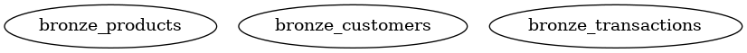
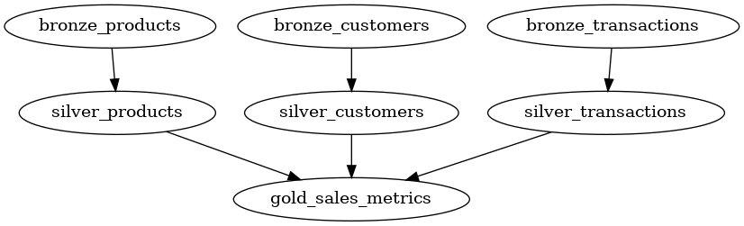

# Introduction

A blueprint is a Python function decorator to declaratively design a table/entity. It is inspired by dbt and SQLMesh "models".
However, instead of writing in SQL with jinja-like templates, you write in pure Python - there's no "compilation" step.

When a function is decorated with the `Blueprint.register` decorator, it is automatically registered in a `JobRegistry` which is used for creating the Directed Acyclic Graph (DAG) for running the blueprints in right order, and with highest possible concurrency.

## Simple example
A simple example is a "source" blueprint. It has no dependencies and can thus be executed as the first blueprint in the DAG.
The example just returns a dataframe, however, it could be any source, e.g. reading from external storage, a REST API or a database, however it **must** return a dataframe.

```{.python notest}
from blueno import blueprint, Blueprint, DataFrameType


@Blueprint.register()
def bronze_products() -> DataFrameType:
    df = pl.DataFrame(
        {
            "a": [1, 2, 3],
            "b": ["foo", "bar", "baz"],
        }
    )

    return df

```

The `blueprint` decorator has many inputs. You can see a full list of inputs at the [Blueprint API Reference](../../api/blueprint.md).

One parameter is `table_uri` which defines where to store this dataframe as a delta table. If not specified, the blueprint will not be stored in a table, however it will still be available as an ephemeral dataframe (much like a temporary table) for downstream blueprints.

The `blueprint` can now be run with the command.

```sh
blueno run --project-path path/to/blueprints
```

## Another example
The above example is very barebones, and does not utilize the full potential of blueprints. Let's create a more advanced example - a derived table of the `bronze_product` blueprint presented above.

The product blueprint now has proper columns; `product_id` and `product_name`. We'll also introduct a customer blueprint, and a sales blueprint for our sources.

In addition, the blueprint decorator is now supplied with the `table_uri` parameter, so that they are stored in delta tables when run.

```python
from blueno import Blueprint, DataFrameType

@Blueprint.register(
    table_uri="lakehouse/bronze/products",
    format="delta",    
)
def bronze_products() -> DataFrameType:
    df = pl.DataFrame(
        {
            "product_id": [1, 2, 3],
            "product_name": ["ball", "bat", "tent"],
            "price": [4.99, 9.99, 29.99]
        }
    )

    return df

@Blueprint.register(
    table_uri="lakehouse/bronze/customers",
    format="delta",    
)
def bronze_customers() -> DataFrameType:
    df = pl.DataFrame(
        {
            "customer_id": ["CUST01", "CUST02", "CUST03"],
            "customer_name": ["Mary", "Bob", "Alice"],
        }
    )

    return df

@Blueprint.register(
    table_uri="lakehouse/bronze/sales",
    format="delta",    
)
def bronze_sales() -> DataFrameType:
    df = pl.DataFrame(
        {
            "customer_id": ["CUST01", "CUST02", "CUST03"],
            "product_id": [3, 2, 1],
            "transaction_date": ["2025-01-01", "2025-01-02", "2025-01-03"],
            "quantity": [2, 1, 1],
        }
    )

    return df
```

If we now run the command with the `--show-dag` flag.

```sh
blueno run path/to/blueprints --show-dag
```

We can see the three blueprints. However, since there are no dependencies, the DAG is quite uninteresting.



So lets add some silver blueprints. The silver layer is usually cleansed data. In this example, we ensure there are no duplicates in the products table and in the customers table.

In addition, transactions with a `quantity` of zero are removed.


```python
from blueno import Blueprint
from blueno.types import DataFrameType

@Blueprint.register(
    table_uri="lakehouse/silver/products",
    format="delta",    
    primary_keys=["product_id"],
)
def silver_products(self: Blueprint, bronze_products: DataFrameType) -> DataFrameType:
    df = bronze_products.unique(subset=self.primary_keys)

    return df


@Blueprint.register(
    table_uri="lakehouse/silver/customers",
    format="delta",    
    primary_keys=["customer_id"],
)
def silver_customers(self: Blueprint, bronze_customers: DataFrameType) -> DataFrameType:
    df = bronze_customers.unique(subset=self.primary_keys)

    return df


@Blueprint.register(
    table_uri="lakehouse/silver/transactions",
    format="delta",
    primary_keys=["product_id"],
)
def silver_transactions(bronze_transactions: DataFrameType) -> DataFrameType:
    df = bronze_transactions.filter(pl.col("quantity") > 0)

    return df
```

Let's look at the DAG:


As expected, we can see the that the bronze tables are upstream dependencies of the silver tables. How is this achieved?

It is achieved by adding a parameter to the function signature of the blueprint. For example, we added the `bronze_transactions: DataFrameType` to the `silver_transactions` function signature. This parameter name `bronze_transactions` exactly matches the function **name** of the `bronze_transactions` **blueprint**. Then we can automatically infer this dependency.

In the `silver_products` and `silver_customers` blueprints you can also see the parameter `self: Blueprint`. This can optionally be added if you need to access to some of the blueprints parameters, i.e. `table_uri` or `primary_keys`. In this example, we need to know our primary keys to deduplicate.

Lastly, we will add the metrics table in the gold layer, which combines the three silver tables:

```python
from blueno import Blueprint
from blueno.types import DataFrameType

@Blueprint.register(
    table_uri="lakehouse/gold/sales_metrics",
    format="delta",    
    write_mode="incremental",
    incremental_column="transaction_date",
)
def gold_sales_metrics(
    silver_transactions: DataFrameType,
    silver_customers: DataFrameType,
    silver_products: DataFrameType
) -> DataFrameType:
    
    df = (
        silver_transactions
        .join(silver_customers, on="customer_id", how="inner")
        .join(silver_products, on="product_id", how="inner")
        .group_by(
            "transaction_date",
            "customer_id",
            "product_id",
        )
        .agg(
            pl.sum("quantity").alias("total_quantity"),
            (pl.col("quantity") * pl.col("price")).sum().alias("total_sales"),
        )
    )

    return df
```

All three silver blueprints are added as dependencies and are inner joined to ensure we only show sales metrics for valid products and valid customers.
In addition, the total sales metric is calculated by multiplying the quantity and price.

In the `blueprint` decorator some new parameters were introduced. Namely `write_mode` and `incremental_column`. The `write_mode` determines how the resulting dataframe is written to the destination. The `incremental` write mode filters the dataframe on the `incremental_column` by the max value of the `incremental_column` in the target table. After it is filtered, the resulting dataframe is appended to the target table.
If not supplied, the `write_mode` defaults to `overwrite`. 

You can see a complete list of supported write modes in the [Blueprint API Reference](../../api/blueprint.md).

Now we can run the blueprints again, however this time I supply the command with `--select`. This ensures we *only* run the `gold_sales_metrics` blueprint, because I know we already ran its upstream dependencies, so there is no need to re-run them.

```sh
blueno run --project-path path/to/blueprints
           --select gold_sales_metrics \
           --display-mode log \
           --log-level INFO \
           --show-dag
```

/// tip
You can for example also use `--select +gold_sales_metrics` (prefixed and/or suffixed by one or more `+`'s).

The number of `+`'s will denote the number of levels of upstream and downstream dependencies to also run.

I.e. `+gold_sales_metrics` will select the `gold_sales_metrics` job and its direct upstream dependencies (parents). `++silver_product` will select the `silver_product` job and two generations of upstream dependencies (parents + grandparents).

You can also be more specific such as `--select bronze_products+ silver_customers`. This will run `bronze_products` and its direct downstream depencies (`silver_products`); and `silver_customers`
///

/// note
You need `graphviz`installed to show the DAG. If you do not have it installed, you can exclude the `--show-dag` option.
///

We can see in the console output, that only the `gold_sales_metrics` was run.

```sh
2025-05-18 18:10:51 - blueno - INFO - Starting blueprint execution 1 tasks at a time
2025-05-18 18:10:51 - blueno - INFO - Running: gold_sales_metrics
2025-05-18 18:10:51 - blueno - INFO - Finished: gold_sales_metrics
```

The resulting DAG is:




And we can see the resulting sales metrics table by printing to console.

```{.python notest}
import polars as pl

df = pl.read_delta("lakehouse/gold/sales_metrics")
print(df)
```

| transaction_date  | customer_id | product_id | total_quantity            | total_sales  |
| ---               | ----------  | --------   | -----------------         | ------------ |
| str               | str         | i64        | i64                       | f64          |
| 2025-01-03        | CUST03      | 1          | 1                         | 4.99         |
| 2025-01-02        | CUST02      | 2          | 1                         | 9.99         |
| 2025-01-01        | CUST01      | 3          | 2                         | 59.98        |

## Extending the `Blueprint` class

Sometimes, the built-in write methods or post-processing steps in `Blueprint` might not be enough for your needs. In these cases, you can create your own class that inherits from `Blueprint` and override specific methods or properties.

For example, let’s say you want to:

- Add a post-processing step that extracts the date from a timestamp column.
- Add a custom write method that overwrites only specific partitions in your table.

To do this, you’ll need to override the following properties or methods:

- `_extend_post_transforms` to add your custom post-processing.
- `_extend_write_modes` to add your custom write method.
- Optionally, `_extend_input_validations` to add extra input checks.

### Add a custom post transformation

First, create a new class that inherits from `Blueprint`. Add a method to extract the date from a timestamp column, and register it in `_extend_post_transforms`:

```python
from blueno import Blueprint
from dataclasses import dataclass
import polars as pl
from typing import Optional, Dict, Callable

@dataclass(kw_only=True)
class CustomBlueprint(Blueprint):
    date_partition_column: Optional[str] = None

    def _add_date_partition(self) -> pl.DataFrame:
        self._dataframe = self._dataframe.with_columns(
            pl.col(self.date_partition_column).dt.date().alias("date"),
        )

    @property
    def _extend_post_transforms(self) -> Dict[str, Callable]:
        return {
            "add_date_partition": self._add_date_partition
        }
```

### Use your custom blueprint

Now you can use your new class and specify the custom post-transform:

```{.python continuation}
from datetime import datetime, timezone

@CustomBlueprint.register(
    table_uri="/tmp/my_deltatable",
    format="delta",
    date_partition_column="ts",
    post_transforms=["add_date_partition"]
)
def my_transformation():
    df = pl.DataFrame({
        "a": [1],
        "ts": [datetime.now(timezone.utc)]
    })
    return df
```

### Add custom input validation (optional, but recommended)

To make sure users don’t forget to set `date_partition_column` when using your post-transform, you can add a validation rule:

```{.python continuation}
from typing import List, Tuple

@dataclass(kw_only=True)
class CustomBlueprint(Blueprint):
    # ...existing code...

    @property
    def _extend_input_validations(self) -> List[Tuple[bool, str]]:
        return [
            (
                "add_date_partition" in self._post_transforms and not isinstance(self.date_partition_column, str),
                "date_partition_column must be provided when add_date_partition post_transform is set"
            )
        ]
```

### Add a custom write mode

You can also add a write method that only overwrites the partitions present in your dataframe:

```{.python continuation}
from deltalake import write_deltalake

@dataclass(kw_only=True)
class CustomBlueprint(Blueprint):
    # ...existing code...

    def _write_mode_overwrite_partition(self) -> None:
        partitions = self._dataframe.select("date").unique().to_dict(as_series=False).get("date", [])
        partitions_str = [partition.strftime("%Y-%m-%d") for partition in partitions]
        partition_predicate = f"""date in ('{"','".join(partitions_str)}')""" if partitions_str else None

        write_deltalake(
            table_or_uri=self.table_uri,
            data=self._dataframe.to_arrow(),
            partition_by=["date"],
            mode="overwrite",
            predicate=partition_predicate,
        )

    @property
    def _extend_write_modes(self) -> Dict[str, Callable]:
        return {
            "overwrite_partition": self._write_mode_overwrite_partition
        }
```

---

For a complete, working example, see: [test_custom_blueprint](https://github.com/mrjsj/blueno/blob/main/tests/blueprints/test_custom_blueprint.py)