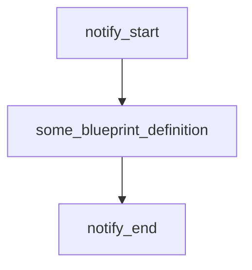

# Tasks

If you need something orchestrated in your DAG which shouldn't be expressed a blueprint, then you can use a `task`.

A task is just any arbitrary code which can have any number (or zero) upstream or downstream dependencies. 

This could for example be a Slack notification or a web hook request, or some custom logging.


```python
from blueno import Blueprint, Task
import logging

logger = logging.getLogger(__name__)

@Task.register()
def notify_start() -> None:
    logger.info("Blueno data pipeline started.")

@Blueprint.register()
def some_blueprint_definition(notify_start):
    ...

@Task.register()
def notify_end(some_blueprint_definition) -> None:
    logger.info("Blueno data pipeline ended.")

```

This will create the following DAG:

