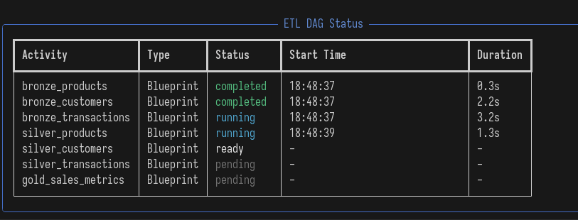

# Quick start

If you just want to get started, you can download the download an example and run it.

## Installation
First install the tool:

//// tab | `pip`

<div class="termy">
```bash
$ pip install blueno
---> 100%
Successfully installed blueno
```
</div>
////
//// tab | `uv`
<div class="termy">
```console
$ uv add blueno
---> 100%
Successfully installed blueno
```
</div>
////

## Create a project

Copy the example and save it to a folder, e.g. `blueprints/example.py`.

Using the medallion architecture the example consists of:

- three mocked bronze source tables
- three silver tables
- and a single gold table.

```python
import random
import time

import polars as pl

from blueno import Blueprint, DataFrameType

RAND_SIZE = 10


@Blueprint.register(table_uri="lakehouse/bronze/product", format="delta")
def bronze_product() -> DataFrameType:
    df = pl.DataFrame(
        {
            "product_id": [1, 2, 3],
            "product_name": ["ball", "bat", "tent"],
            "price": [4.99, 9.99, 29.99],
        }
    )

    time.sleep(random.random() * RAND_SIZE)

    return df


@Blueprint.register(table_uri="lakehouse/bronze/transaction", format="delta")
def bronze_transaction() -> DataFrameType:
    df = pl.DataFrame(
        {
            "product_id": [3, 2, 1, 1],
            "transaction_date": ["2025-01-01", "2025-01-02", "2025-01-03", "2025-01-04"],
            "quantity": [2, 1, 1, 0],
        }
    )
    time.sleep(random.random() * RAND_SIZE)

    return df


@Blueprint.register(
    table_uri="lakehouse/silver/product",
    format="delta",    
    primary_keys=["product_id"],
)
def silver_product(self: Blueprint, bronze_product: DataFrameType) -> DataFrameType:
    df = bronze_product.unique(subset=self.primary_keys)
    time.sleep(random.random() * RAND_SIZE)

    return df


@Blueprint.register(
    table_uri="lakehouse/silver/transaction",
    format="delta",
    primary_keys=["product_id"],
)
def silver_transaction(bronze_transaction: DataFrameType) -> DataFrameType:
    df = bronze_transaction.filter(pl.col("quantity") > 0)
    time.sleep(random.random() * RAND_SIZE)

    return df


@Blueprint.register(
    table_uri="lakehouse/gold/sales_metric",
    format="delta",
    write_mode="incremental",
    incremental_column="transaction_date",
)
def gold_sales_metric(
    silver_transaction: DataFrameType,
    silver_product: DataFrameType,
) -> DataFrameType:
    df = (
        silver_transaction
        .join(silver_product, on="product_id", how="left")
        .group_by(
            "transaction_date",
            "product_id",
        )
        .agg(
            pl.sum("quantity").alias("total_quantity"),
            (pl.col("quantity") * pl.col("price")).sum().alias("total_sales"),
        )
    )
    time.sleep(random.random() * RAND_SIZE)

    return df

```

## Preview a blueprint
Before materializing the tables, or when working on transformations, it's a good idea to **preview** a transformation first.

For example, we can preview the `silver_product` transformation

```bash
blueno preview --project-dir ./blueprints --transformation-name silver_product
```

This will show the dataframe printed to the terminal.

```bash
shape: (3, 3)
┌────────────┬──────────────┬───────┐
│ product_id ┆ product_name ┆ price │
│ ---        ┆ ---          ┆ ---   │
│ i64        ┆ str          ┆ f64   │
╞════════════╪══════════════╪═══════╡
│ 3          ┆ tent         ┆ 29.99 │
│ 2          ┆ bat          ┆ 9.99  │
│ 1          ┆ ball         ┆ 4.99  │
└────────────┴──────────────┴───────┘
```


## Run the blueprints
Now that we validated the transformation outputs the correct data, we can run and materialize all the blueprints.

Run using one of the options below by pointing the project directory to the folder you saved the `example.py` to.
//// tab | CLI
```bash
blueno run --project-dir ./blueprints --concurrency 2
```
////
//// tab | Python
Create another python file, i.e. `main.py`, and run it.

```{.python notest}

from blueno.cli import run

run(project_dir="./blueprints", concurrency=2)
```
////

You should see a table with the run status of the blueprints in the DAG similar to the one below.


 
## Result

Once complete, you can navigate to the created lakehouse folder and discover what the was created.

The final folder structure should look something like this

```console
.
├── blueno.log
├── blueprints
│   └── example.py
├── lakehouse
│   ├── bronze
│   │   ├── product
│   │   │   ├── _delta_log
│   │   │   │   ├── 00000000000000000000.json
│   │   │   │   └── 00000000000000000001.json
│   │   │   └── part-00001-00885a2d-23b9-46cb-9d78-fd0e73200e00-c000.snappy.parquet
│   │   └── transaction
│   │       ├── _delta_log
│   │       │   ├── 00000000000000000000.json
│   │       │   └── 00000000000000000001.json
│   │       └── part-00001-13268cd8-b475-4d54-a52f-37d86c1858e2-c000.snappy.parquet
│   ├── gold
│   │   └── sales_metric
│   │       ├── _delta_log
│   │       │   ├── 00000000000000000000.json
│   │       │   └── 00000000000000000001.json
│   │       └── part-00001-0e8a37a1-63c0-4a43-abc8-748518ad7463-c000.snappy.parquet
│   └── silver
│       ├── product
│       │   ├── _delta_log
│       │   │   ├── 00000000000000000000.json
│       │   │   └── 00000000000000000001.json
│       │   └── part-00001-aa5dba8e-426a-438e-b5a0-7e1c05208b31-c000.snappy.parquet
│       └── transaction
│           ├── _delta_log
│           │   ├── 00000000000000000000.json
│           │   └── 00000000000000000001.json
│           └── part-00001-aa0a9af5-860d-4c10-8fad-362eff6c8415-c000.snappy.parquet
└── main.py
```

