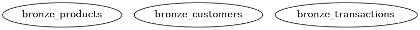
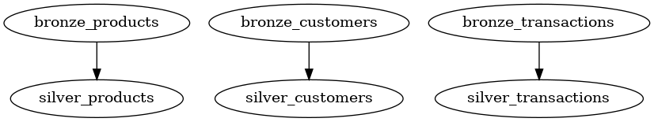
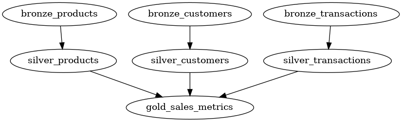

# Introduction

A blueprint is a Python function decorator to declaratively design a table/entity. It is inspired by dbt and SQLMesh "models".
When a function is decorated with the `blueprint` decorator, it is automatically registered in a `BlueprintRegistry` which is used for creating the Directed Acyclic Graph (DAG) for running the blueprints in right order, and with highest possible concurrency.

## Simple example
A simple example is a "source" blueprint. It has no dependencies and can thus be executed as the first blueprint in the DAG.
The example just returns a DataFrame, however, it could be any source, e.g. reading from external storage, a REST API or a database, however it **must** return a DataFrame.

```python
from blueno import blueprint, Blueprint, DataFrameType


@blueprint
def bronze_product() -> DataFrameType:
    df = pl.DataFrame(
        {
            "a": [1, 2, 3],
            "b": ["foo", "bar", "baz"],
        }
    )

    return df

```

The `blueprint` decorator has many inputs. You can see a full list of inputs at the [Blueprint API Reference](../../reference/blueprints.md).
One parameter is `table_uri` which defines where to store this DataFrame as a delta table. If not specified, the blueprint will not be stored in a table, however it will still be available as an ephemeral DataFrame for downstream blueprints.

The `blueprint` can now be run with the command.

```sh
blueno run --debug
```

## Another example
The above example is very barebones, and does not utilize the full potential of blueprints. Let's create a more advanced example - some derived tables from the `bronze_product` listed above. We'll make it abit more life like.

The product blueprint now has prope `product_id` and `product_name`. We'll also introduct a customer blueprint, and a sales blueprint for our sources.
In addition, the blueprint decorator is now supplied with the `table_uri` parameter, so that they are stored in delta tables when run.
```python
from blueno import blueprint, Blueprint, DataFrameType

@blueprint(
    table_uri="lakehouse/bronze/product"
)
def bronze_product() -> DataFrameType:
    df = pl.DataFrame(
        {
            "product_id": [1, 2, 3],
            "product_name": ["ball", "bat", "tent"],
            "price": [4.99, 9.99, 29.99]
        }
    )

    return df

@blueprint(
    table_uri="lakehouse/bronze/customer"
)
def bronze_customer() -> DataFrameType:
    df = pl.DataFrame(
        {
            "customer_id": ["CUST01", "CUST02", "CUST03"],
            "customer_name": ["Mary", "Bob", "Alice"],
        }
    )

    return df

@blueprint(
    table_uri="lakehouse/bronze/sales"
)
def bronze_sales() -> DataFrameType:
    df = pl.DataFrame(
        {
            "customer_id": ["CUST01", "CUST02", "CUST03"],
            "product_id": [3, 2, 1],
            "transaction_date": ["2025-01-01", "2025-01-02", "2025-01-03"],
            "quantity": [2, 1, 1],
        }
    )

    return df

```

If we now run the command with the `--show-dag` flag

```sh
blueno run --show-dag
```

We can see the three blueprints. However, since there are no dependencies, the DAG is quite uninteresting.



So lets add some silver blueprints. The silver layer is usually cleansed data. In this example, we ensure there are no duplicates in the products table and in the customers table.

In addition, transactions with a `quantity` of zero are removed.


```python
@blueprint(
    table_uri="lakehouse/silver/products",
    primary_keys=["product_id"],
)
def silver_products(self: Blueprint, bronze_products: DataFrameType) -> DataFrameType:
    df = bronze_products.unique(subset=self.primary_keys)

    return df


@blueprint(
    table_uri="lakehouse/silver/customers",
    primary_keys=["customer_id"],
)
def silver_customers(self: Blueprint, bronze_customers: DataFrameType) -> DataFrameType:
    df = bronze_customers.unique(subset=self.primary_keys)

    return df


@blueprint(
    table_uri="lakehouse/silver/products",
    primary_keys=["product_id"],
)
def silver_transactions(bronze_transactions: DataFrameType) -> DataFrameType:
    df = bronze_transactions.filter(pl.col("quantity") > 0)

    return df
```

Let's look at the DAG:



As expected, we can see the that the bronze tables are upstream dependencies of the silver tables. How is this achieved?

It is achieved by adding a parameter to the function signature of the blueprint. For example, we added the `bronze_transactions: DataFrameType` to the `silver_transactions` function signature. This parameter name `bronze_transactions` exactly matches the function **name** of the `bronze_transactions` **blueprint**. Then we can automatically infer this dependency.

In the `silver_products` and `silver_customers` blueprints you can also see the parameter `self: Blueprint`. This can optionally be added if you need to access to some of the blueprints parameters, i.e. `table_uri` og `primary_keys`. In this example, we need access to the primary keys of the blueprints to deduplicate.

Lastly, we will add the metrics table in the gold layer, which combines the three silver tables:

```python
@blueprint(
    table_uri="lakehouse/gold/sales_metrics",
    write_mode="incremental",
    incremental_column="transaction_date",
)
def gold_sales_metrics(
    silver_transactions: DataFrameType,
    silver_customers: DataFrameType,
    silver_products: DataFrameType
) -> DataFrameType:
    
    df = (
        silver_transactions
        .join(silver_customers, on="customer_id", how="inner")
        .join(silver_products, on="product_id", how="inner")
        .group_by(
            "transaction_date",
            "customer_id",
            "product_id",
        )
        .agg(
            pl.sum("quantity").alias("total_quantity"),
            (pl.col("quantity") * pl.col("price")).sum().alias("total_sales"),
        )
    )

    return df
```

All three silver blueprints are added as dependencies and are inner joined to ensure we only show sales metrics for valid products and valid customers.
In addition, the total sales metric is calculated by multiplying the quantity and price.

In the `blueprint` decorator some new parameters were introduced. Namely `write_mode` and `incremental_column`. The `write_mode` determines how the resulting DataFrame is written to the destination. The `incremental` write mode filters the DataFrame on the `incremental_column` by the max value of the `incremental_column` in the target table. After it is filtered, the resulting DataFrame is appended to the target table.
If not supplied, the `write_mode` defaults to `overwrite`. You can see a complete list of supported write modes in the [Blueprint API Reference](../../reference/blueprints.md).

Now we can run the blueprints again, however this time I supply the command with `--select`. This ensure we *only* run the `gold_sales_metrics` blueprint, because I know we already ran its upstream dependencies, so there is no need to re-run them.

```sh
blueno run --select gold_sales_metrics --show-dag
```

We can see in the console output, that only the `gold_sales_metrics` was run.

```sh
2025-05-18 18:10:51 - blueno - INFO - Starting blueprint execution 1 tasks at a time
2025-05-18 18:10:51 - blueno - INFO - Running: gold_sales_metrics
2025-05-18 18:10:51 - blueno - INFO - Finished: gold_sales_metrics
```

The resulting DAG is:




And we can see the resulting sales metrics table by printing to console.

```python
df = pl.read_delta("/lakehouse/gold/sales_metrics")
print(df)
```

| transaction_date  | customer_id | product_id | total_quantity            | total_sales  |
| ---               | ----------  | --------   | -----------------         | ------------ |
| str               | str         | i64        | i64                       | f64          |
| 2025-01-03        | CUST03      | 1          | 1                         | 4.99         |
| 2025-01-02        | CUST02      | 2          | 1                         | 9.99         |
| 2025-01-01        | CUST01      | 3          | 2                         | 59.98        |

## Remote storage
You can also read and write directly in a Microsoft Fabric Lakehouse (OneLake) or Azure Data Lake Storage from your local environment.

Simply change the path of your blueprint `table_uri` to:

```python
abfss://{workspace_name}@onelake.dfs.fabric.microsoft.com/{lakehouse_name}.Lakehouse/Tables
```

You must have the Azure CLI installed and be logged in.

You can also trigger your blueprints to be run on a Microsoft Fabric Capacity, see [Remote execution](./remote-execution.md) for more information.